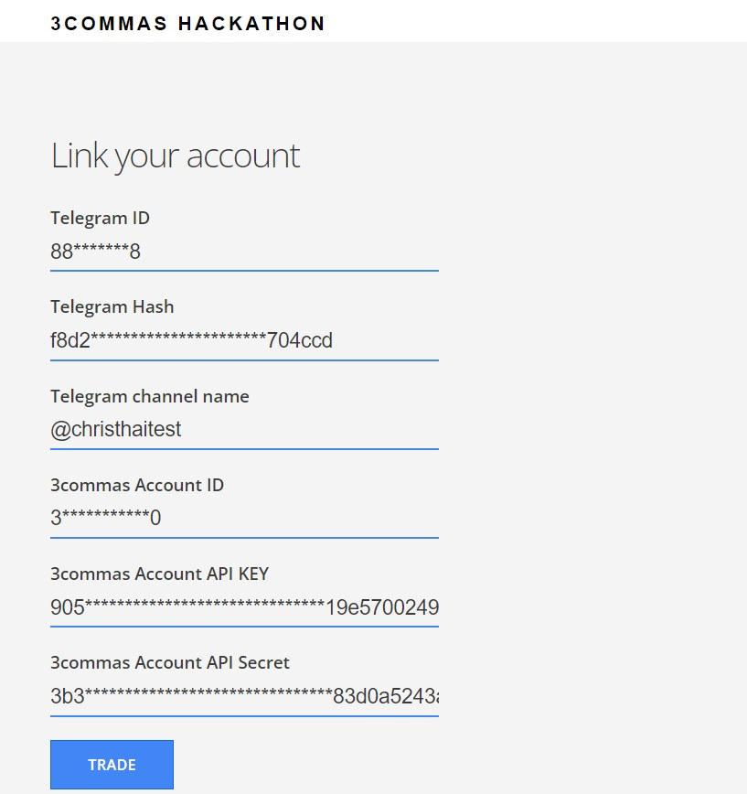
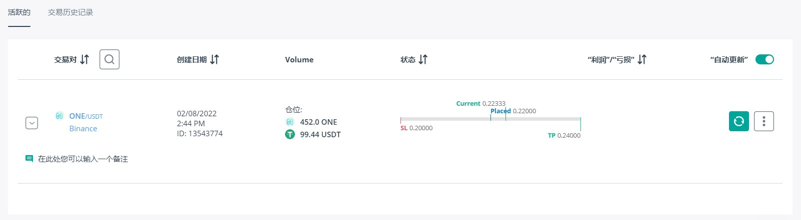

# 3commas Auto trade with Telegram signals

A webapp that triggers a new trade by calling 3commas API when you get a "BUY" signal from some Telegram channel.
For example, you may follow some Trading strategies from [coinmatics](https://coinmatics.com/app/strategies) by subscribing to the Telegram bot. You would like to execute trades automatically then you don't need to track the Telegram message all the time. Furthermore, With the help of 3commas, You may place more advanced trade like setting Stop-loss price and Target price at the same time, etc.

### Running locally

1. Create a virtualenv `python3 -m venv .venv`
2. Initiate the virtualenv `source .venv/bin/activate`.
3. Install the packages `pip install -r requirements.txt`.
4. Run `python3 routes.py` in root directory.
5. Open `http://localhost:5000/` in your browser
6. fill out the account INFO Form and click trade

### HOW TO 

1. Prepare your Telegram bot authentication token, following here [Telegram bots](https://core.telegram.org/bots#6-botfather) to generate one.

2. Open the WEB APP, fill in the **Signup** form to link your 3commas account API and Telegram bots, including the Telegram channel which you are going to track to trigger the trade

3. Click **TRADE** button then it will follow your dedicated Telegram channel in the background. Once there are some signals coming then it will execute a new tarde with the relevant Crypto Coin.

As an example, this test Telegram Channel is tracked and get the "BUY" signal  

it will trigger a new trade by calling 3commas API automatically, like this one

### Contact Info
- Telegram ID - christhai_wu